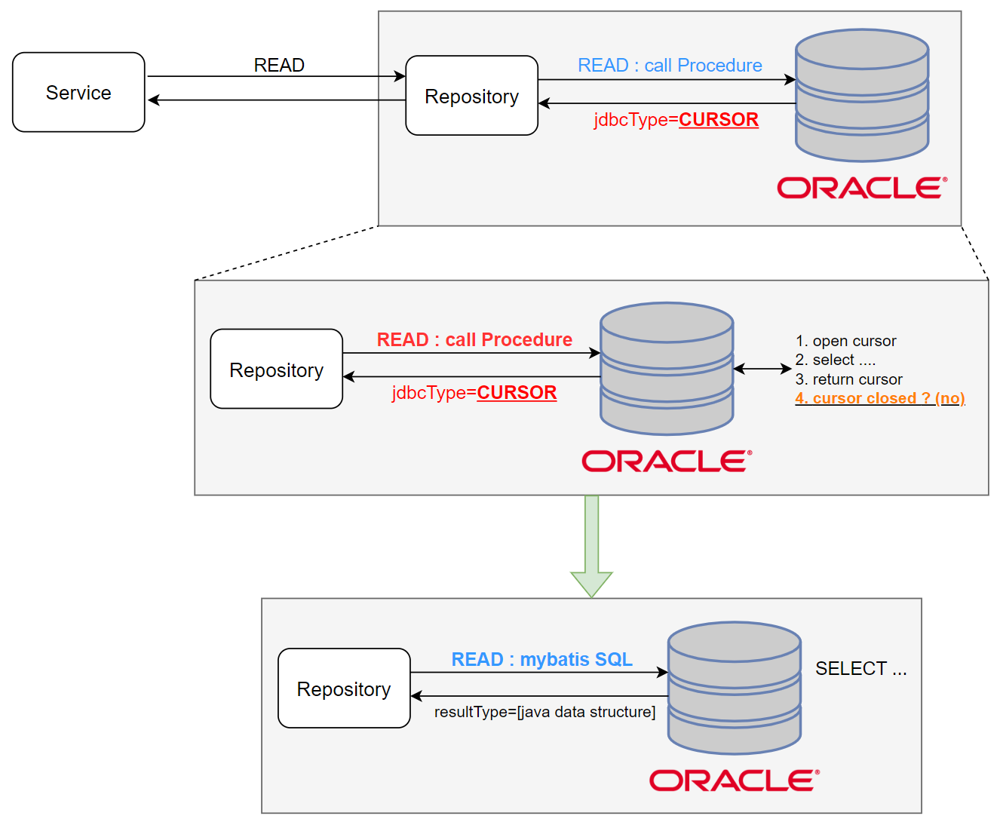
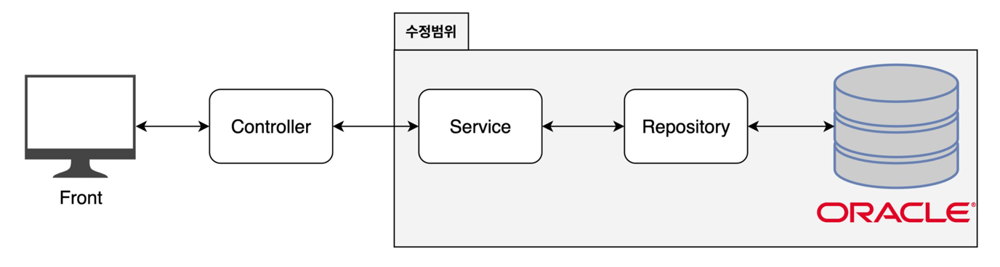
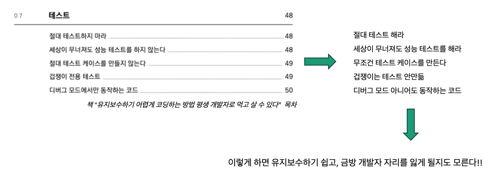
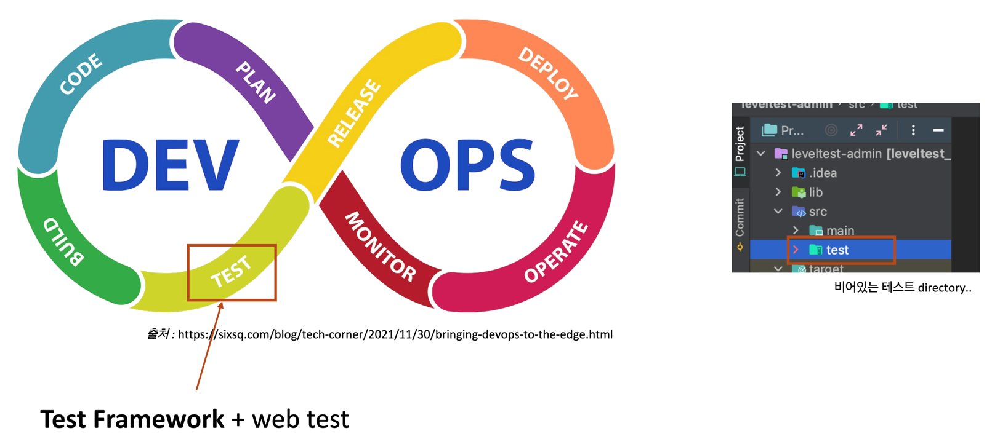
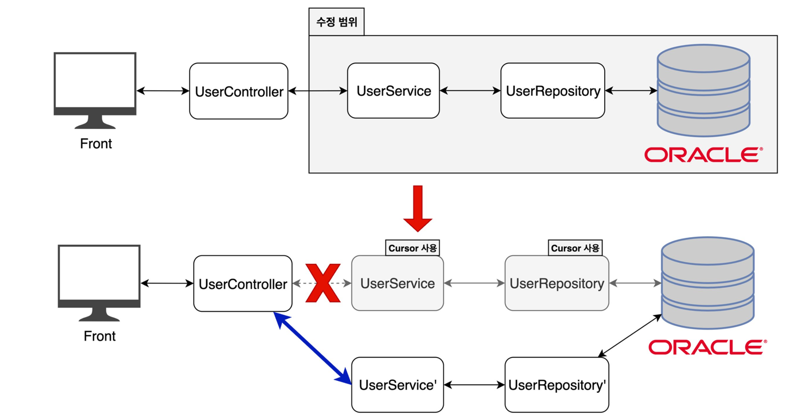

### 목차

1. 테스트 도입의 발단
2. 작업 계획
3. Why Test Code?
    1. 유지보수와 테스트 코드
    2. build -> test -> deploy
4. 테스트 방법
    1. 테스트해야 하는 것
    2. 어떻게 테스트해야 할까
5. 테스트 코드 소개
    1. as-is 코드와 to-be 코드 동작 비교
    2. to-be method 에 대한 단위 테스트
6. 성과

---

## 1. 테스트 도입의 발단



- WAS 에서 Oracle Procedure를 호출하여 Oracle Cursor를 무분별하게 사용 중
- 이는 접속자수 (Oracle 접속 Session)가 많아지면 Oracle에 부하를 줄 위험이 있음
- **따라서 Read-Only 작업을 위해 Cursor를 사용하는 Procedure를 JAVA API로 전환하자**

## 2. 작업 계획



#### 작업 target

- Oracle Procedure 23개
- WAS Service method 18개
- 기타 선언하고 쓰지 않는 Procedure n개....

#### 작업 방법 (후보)

- 초고수 : 맘대로 코드 다 고치고 웹에서 테스트
- Log, Debug point, Json 문자열 비교 등
- 테스트 코드 작성 후 테스트
    - Test Framework 활용 <sub>JUnit, Mockito, Spock</sub>

## 3. Why Test Code?

### 3.1. 유지보수와 테스트 코드



- 유지보수 용이

### 3.2. build -> test -> deploy



- 서비스 라이프사이클에서 부재 중인 Test의 위험성

## 4. 테스트 방법

### 4.1. 테스트해야 하는 것



- 기존의 메서드와 새로운 메서드가 작동하는 방식이 일치하는가?
- 새롭게 추가된 메서드에 대한 단위 테스트 코드 필요

### 4.2. 어떻게 테스트해야 할까

1. 기존의 메서드와 새로운 메서드가 반환하는 객체 자체에 대한 비교
    - e.g. as-is 가 리턴하는 map과 to-be 의 map에 대한 `equals()` 비교
2. 새로운 메서드에 대한 단위 테스트 작성
    - 추후 또 다른 수정작업에 대비

## 5. 테스트 코드 소개

### 5.1. as-is 코드와 to-be 코드의 동작 일치 비교

```java

@ExtendWith(SpringExtension.class) // JUnit5 에서는 @RunWith 대신 @ExtendWith 사용
@ContextConfiguration(classes = com.yoons.ys.TestConfig.class) // TestConfig 클래스를 로드하여 테스트에 사용
@TestInstance(TestInstance.Lifecycle.PER_CLASS) // 테스트 클래스당 인스턴스를 하나만 만들어 사용
public class DelCursorTest {

    @Autowired
    private MemberService memberService; // 의존성 주입

    @Test
    @DisplayName("tmp_pkg_process.get_test_result")
        // 테스트 이름
    void getPeTestResult() throws Exception {

        HashMap<String, Object> dto = new HashMap<String, Object>() {{
            put("no1", 111322);
            put("no2", 2311);
        }};

        HashMap<String, Object> original = memberService.getPeTestResult(dto);
        HashMap<String, Object> tobe = memberService.getPeTestResultTOBE(dto);

        assertTrue(tobe.get("rows1").equals(original.get("rows1")));
        assertThat(tobe.get("rows2").toString(), is(original.get("rows2").toString()));
        assertTrue(tobe.get("rows3").equals(original.get("rows3")));
        assertTrue(tobe.get("rows4").equals(original.get("rows4")));
        assertTrue(tobe.get("rows5").equals(original.get("rows5")));
        assertTrue(tobe.equals(original));
    }
}
```

### 5.2. to-be method 에 대한 단위 테스트

```java

@ExtendWith(SpringExtension.class) // JUnit5 에서는 @RunWith 대신 @ExtendWith 사용
@ContextConfiguration(classes = com.yoons.ys.TestConfig.class) // TestConfig 클래스를 로드하여 테스트에 사용
@TestInstance(TestInstance.Lifecycle.PER_CLASS) // 테스트 클래스당 인스턴스를 하나만 만들어 사용
public class MemberServiceTest {

    @Autowired
    private MemberService memberService; // 의존성 주입

    @Test
    @DisplayName("tmp_pkg_process.get_test_result")
        // 테스트 이름
    void getPeTestResult() throws Exception {

        HashMap<String, Object> dto = new HashMap<String, Object>() {{
            put("no1", 111322);
            put("no2", 2311);
        }};

        HashMap<String, Object> result = memberService.getPeTestResultTOBE(dto);
        assertThat(result, is(notNullValue()));
        assertThat(result.get("rows1"), is(notNullValue()));
        assertThat(result.get("rows1"), is(notNullValue()));
        assertThat(result.get("rows2"), is(notNullValue()));
        assertThat(result.get("rows3"), is(notNullValue()));
        assertThat(result.get("rows4"), is(notNullValue()));
        assertThat(result.get("rows5"), is(notNullValue()));

        //예외 테스트
        dto.put("no1", null);
        assertThrows(NullPointerException.class, () -> {
            memberService.getPeTestResultTOBE(dto);
        });
    }
}

```

## 6. 성과

#### 작업 목표 달성

- Oracle Cursor를 사용하는 procedure를 JAVA API로 전환
    - 23개 procedure 제거
    - 향후 증가할 트래픽을 대비, 잠재 위험 요소 개선

#### 테스트 코드 도입

- Junit Framework 5
- 총 43개의 Test 작성
- Unit 별 요구사항 분석, 명세
    - 필수 파라미터, 반환 값 검증, 예외 처리 등에 대한 테스트

#### 개인 성과, 목표

- [Junit framework 5 공식 문서 정리](https://github.com/gihyeon6394/Junit5-action/blob/master/README.md)
- 온라인 평가 서비스 전체에 Unit Test 적용 예정
- 테스트 작성 노하우
    - 효율적인 Test 작성 방안 고민 <sub>테스트 속도, 가독성 등</sub>
