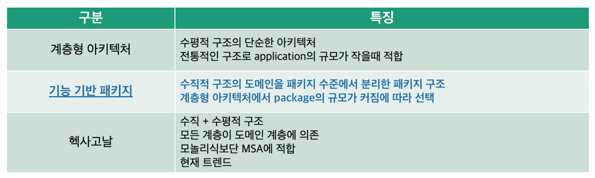
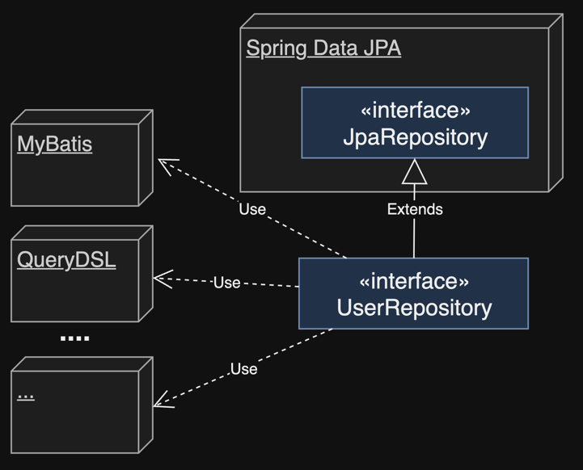
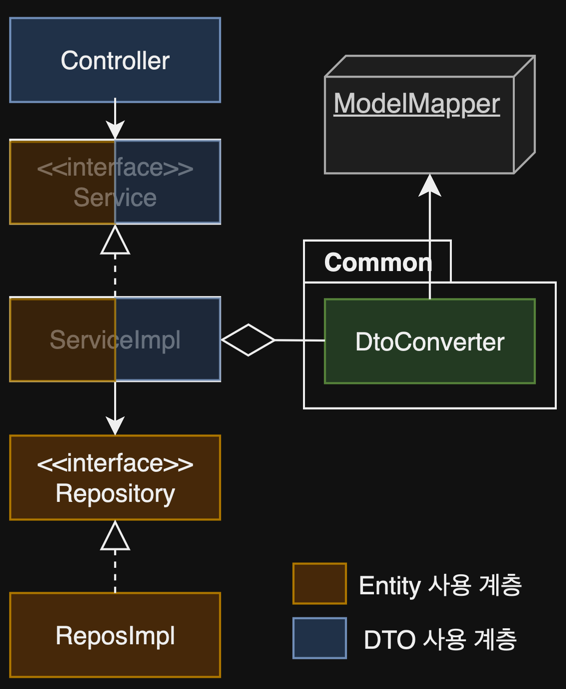

# Spring 패키지 설계하기

1. 패키지 기본구조
    - 패키지 기본구조 계층형? 기능 기반? 헥사고날?
2. Repository 구조
    - Spring Data JPA만 쓰지 않는다
3. DTO 사용 전략
    - DTO 사용여부 정하기
    - DTO 사용 계층과 변환 전략
    - 변환 전략 (번외)
4. 참고

---

## 1. 패키지 기본구조 계층형? 기능 기반? 헥사고날?

### 계층형 아키텍처


- 전통적이고, 단순한 구조 (수평적)
- 구조 파악 용이
- 업무 도메인에 대한 설명 부족
- application이 커지면 패키지가 비대해짐
- DB 의존적 설계


### 기능 기반 아키텍처


- 연관된 기능 (도메인) 단위로 패키징 (수직)
- 클래스 상위 구조 (패키지)에서 업무에 대한 설명이 추가됨
- 특정 use-case 수정 시 변경해야하는 단위는 패키지가 됨

### 헥사고날


- port, adapter를 통해 외부와 내부를 분리
- DB 계층에 대한 의존성 역전
- 클래스 패키지가 많아짐

### 나의 선택 : 기능 기반 패키지



- 계층형보다는 app 규모가 크고, 헥사고날을 구현하기에는 규모가 작음
- 해당 서비스 유지보수 년차가 쌓이면서 업무에 대한 이해 높음 (도메인 정의 가능)
- 헥사고날 아키텍처는 현재 서비스 대비 오버 엔지니어링이라는 판단

## 2. Repository 구조

### 현재 이서비스는

- DB 접근 기술 : JPA Hibernate
    - JPA 중에서도 간단한 CRUD는 Spring Data JPA
    - 더 복잡한 query는 Querydsl
    - 더 복잡한 query는 MyBatis
- 기술별 사용 비율
    - 95% JPA + 5% MyBatis (native query)
    - JPA 안에서는
        - 40% Spring Data JPA + 60% Querydsl

### 단순한 구조



- Compile-error : Interface의 private 멤버 발생
    - 타 기술을 위한 의존성 주입을 위한 필드
- Repository에 query method, Querydsl, nativeq query … (장황)
- Repository의 높은 DB 벤더사 의존도

### 개선한 구조


- `UserRepository` : Spring Data JPA Repository 인터페이스를 상속받아 구현
    - query method로 표현 가능한 기능만 선언
- `UserRepositoryCustom` : Spring Data JPA query method가 불가능한 기능 명세
- `UserRepositoryCustomImpl` : `UserRepositoryCustom` 구현체
    - Spring Data JPA 를 제외한 DB 접근 기술 사용
    - e.g. querydsl, mybatis, jdbc 등

#### 장점

- JPA 의존 Repository와 비의존 분리
- DB 벤더사 변경 시 수정 범위 명확

## 3. DTO 변환 전략

### DTO 사용여부 정하기

#### DTO (Data Transfer Object)가 필요할 때?

- JPA는 DB table과 1:1 매칭되는 Entity 존재
- Entity를 전 계층에 걸쳐 사용할 것인가
- app이 작다면 문제 없음 (오히려 지향)
- app의 규모가 커지면?
    - 단순 조회, 통계, 복잡한 비즈니스 등

#### DTO 가 있으면

- DB 구조 캡슐화 (외부 서버 연동 부담 없음)
- Table과 관계 없이 복잡한 객체구조 설계
- 코드량 감소 (N개의 파라미터 -> 1개의 DTO)

#### 이 서비스에 DTO가 필요한 이유

- DB Tuple 을 모두 Java Map에 담고 있음
- NPE 위험 - 해당 Key가 없다면?
- JPA 도입 후 장황해지는 Entity
    - `@Transient` 필드
    - DB, 비즈니스로직 양쪽에 의존하는 Entity

### DTO 사용 계층과 변환 전략



#### 기본 구조

- ModelMapper library 사용
    - Java 객체의 자동 mapping 지원
    - Method chain 방식의 Custom 매핑 설정 지원
- DTO : Service에서 변환하여 Controller로 전달
- Entity : Repository에서 변환하여 Service로 전달
- `DTOConverter` component 생성
    - DTO, Entity 변환 메서드 정의
    - service 만 사용

````
@Service
public class UserServiceImpl implements UserService{
     ….
    @Autowired   private DtoConverter dtoConverter; //DTO converter 의존성 주입
    
    @Override
    public UserDTO userByID(Long userNo) {
        User user = userRepository.findById(userNo)
                        .orElseThrow(() -> new llegalArgumentException("해당 사용자 없음". userNo = " + userNo));
        return user.toDTO(); // dto 변환
    }
}

@Component
public class DtoConverter {
…
    public UserDTO toDTOUser(User user) {
        ModelMapper modelMapper = getModelMapper();
        modelMapper.typeMap(User.class, UserDTO.class)
                .addMappings(mapper -> {
                 // ..custom 매핑 설정
                });
        return modelMapper.map(User , UserDTO.class);
    }
}
````

### 변환 전략 (번외)

````
@Entity
public class User{
…
 public User toDTOUser(User user) {
    UserDTO userDTO = new UserDTO();
    UserDTO.userID = this.userID;
     ….
    return serDTO;
    }
}
````

- Entity에 DTO를 Entity로 변환하는 메서드를 생성
- 장점 : DTOConverter 클래스 생성 불필요
- 단점 : Entity와 DTO 강결합

## 5. 참고

- [[NHN FORWARD 22] 클린 아키텍처 애매한 부분 정해 드립니다.](https://youtu.be/g6Tg6_qpIVc)