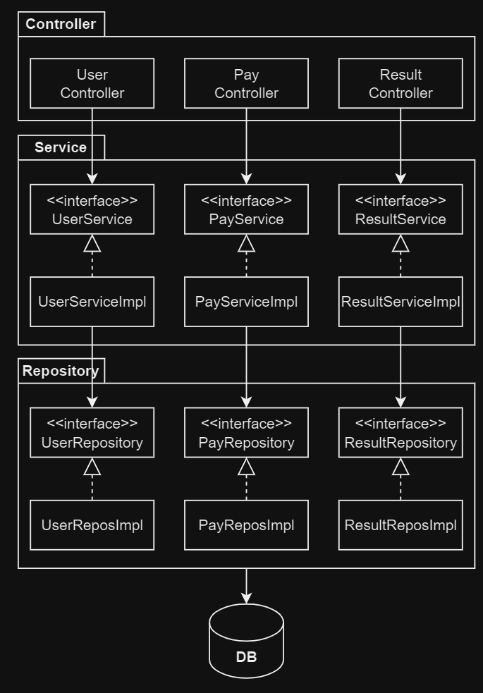
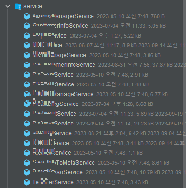
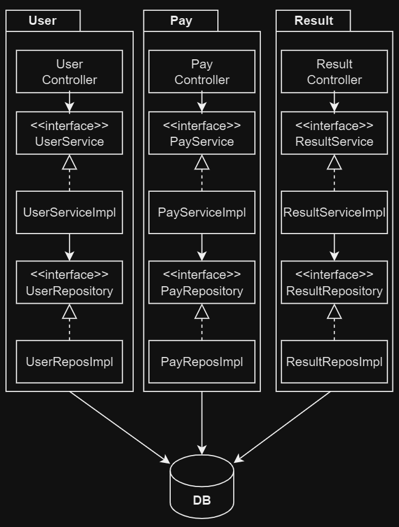
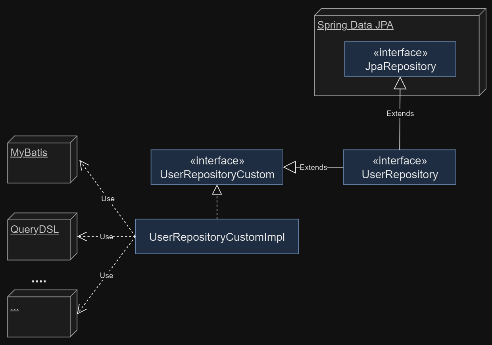
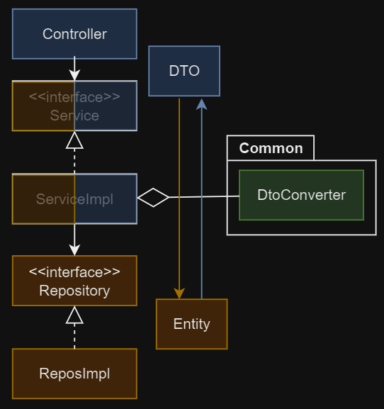

# Spring 패키지 설계하기

1. 패키지 기본구조 계층형? 기능 기반? 헥사고날?
2. Repository 구조
3. DTO 변환 전략
4. 전체 구조 예시
5. 참고

---

## 1. 패키지 기본구조 계층형? 기능 기반? 헥사고날?

### 계층형 아키텍처

- 전통적이고, 단순한 구조 (수평적)
- 구조 파악 용이
- 업무 도메인에 대한 설명 부족
- application이 커지면 패키지가 비대해짐
- DB 의존적 설계

### 기능 기반 아키텍처

- 연관된 기능 (도메인) 단위로 패키징 (수직)
- 클래스 상위 구조 (패키지)에서 업무에 대한 설명이 추가됨
- 특정 use-case 수정 시 변경해야하는 단위는 패키지가 됨

### 계층형 vs 기능 기반

|       | 계층형                                   | 기능 기반                                  |
|-------|---------------------------------------|----------------------------------------|
| 기본 구조 | 수평적, 전통적이고 단순                         | 수직적, 패키지를 도메인 단위로 구조                   |
| 장점    | 구조 파악 용이                              | 패키지를 통해 업무 설계 파악 용이, 코드 수정 시 변경 범위가 명확 |
| 단점    | application이 커지면 패키지가 비대해짐, DB 의존적 설계 | 업무 설계가 어려움                             |

### 헥사고날

- port, adapter를 통해 외부와 내부를 분리
- DB 계층에 대한 의존성 역전
- 클래스 패키지가 많아짐

## 2. Repository 구조

- `UserRepository` : Spring Data JPA Repository 인터페이스를 상속받아 구현
    - query method로 표현 가능한 기능만 선언
- `UserRepositoryCustom` : Spring Data JPA query method가 불가능한 기능 명세
- `UserRepositoryCustomImpl` : `UserRepositoryCustom` 구현체
    - Spring Data JPA 를 제외한 DB 접근 기술 사용
    - e.g. querydsl, mybatis, jdbc 등

## 3. DTO 변환 전략

- DTO, Entity 접근 범위 정의
- DTO : Service에서 변환하여 Controller로 전달
- Entity : Repository에서 변환하여 Service로 전달
- `DTOConverter` component 생성
    - DTO, Entity 변환 메서드 정의
    - service 만 사용

## 4. 전체 구조 예시

## 5. 참고

- [[NHN FORWARD 22] 클린 아키텍처 애매한 부분 정해 드립니다.](https://youtu.be/g6Tg6_qpIVc)