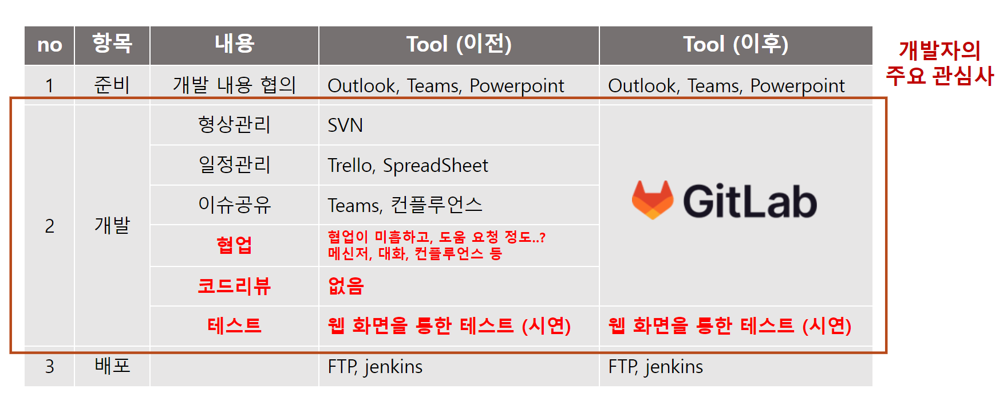

### 목차

1. 어떻게 일했는가
    - Git-flow 이전 이후의 업무방식​
2. git-flow 소개
3. git-flow 로 일해보자
    1. 개발 협의 완료
    2. Milestones 생성
    3. branch checkout
    4. issue 생성
    5. Merge Request & Code Review
    6. 정리
4. 회고
    - 장점
    - 단점
5. 소감

---

**설명하지 않을 내용 : 기초적인 Git의 내용 <sub>ex. push, remote, Git, GitHub, GitLab</sub>**

# 공유 목적

svn 형상관리 툴을 이용해 trunk-based 전략으로 일하던 기존 방식에서  
새롭게 git 형상관리 툴을 도입<sup>1</sup>하고, git-flow 안에서 일한 이점 <sup>2</sup>을 소개하여   
팀원에게 개발 프로세스 전면적인 관점에서 새로운 방식을 제시해보고자 한다.

### 유의사항

깃 호소인도 아니며, Git이 SVN 보다 좋은 툴이라고 평가하지 않는다.  
SVN을 모두 Git으로 전환하라는 메시지도 아니다.

일하는 방식과 목적에 부합한 툴을 적재 적소에 투입하면 그만이며, 방식을 바꿨을 때 성과가 미흡하면 과감히 롤백한다.

### 이번 도입으로 얻은 장점

- 업무 **효율** : 코드 리뷰 용이
- 업무 **투명성** : 소스 코드 책임의 공유
- 업무 **내역** : 업무 히스토리 관리
- **성장** : 업무 태도

# 1. 어떻게 일했는가?

## : 일한 방식의 비교




준비과정 부터 개발, 배포에 이르기 까지 개발자들은 공통적으로 위와 같은 항목을 수행한다.

항목별 툴이 재각각이거나,  
중요한 업무임에도 하지 않는 업무들 <sup>코드리뷰,협업</sup>이 있었고,

GitLab 을 통해 하나의 채널에서 필수 업무를 모두 수행가능케 했다.

**그러나 테스트 과정이 존재하지 않기 때문에 여전히 리스크는 존재한다.**

# 2. git-flow 소개

### git-flow?

git을 활용하여 협업하는 업무 flow를 브랜치 기반의 정책으로 진행하는 것으로 git-flow 의 변형으로 **GitHub**-flow, **GiLab**-flow 등이 존재한다.   
이 업무모듈은 모두 각자의 브랜치 정책에 기반을 두는 것이 핵심이다.

Git-flow 보다 GiHub-flow 가 더 간단하고, GitLab-flow 는 상대적으로 GitHub-flow에 기능을 더했다.  
GitLab의 기능들과 유기적으로 움직일 수 있도록 하기 위함이다. <sub>브랜치명에 이슈번호를 붙인다던가..<sub>

사용하는 Git 서비스에 따라 각 flow 를 지키는게 정석처럼 보이겠으나, 본인은 Git-flow에 필요한 브랜치만 추려서 도입해보았다.  
**업무 세분화, 협업 인원 증가, 단계별 추가 자동화 필요성** 등에 따라 각 flow 를 적절히 변형하여 사용히 가능하겠다.

이번 도입에 본인은 아래 우아한 형제들의 Git-flow 도입 레퍼런스를 적극 참고했다.

[Blog : 우린 Git-flow를 사용하고 있어요](https://techblog.woowahan.com/2553/)


#### git-flow 의 브랜치 정책

- master : 마스터, 리포지터리의 기준, 배포 가능
- develop : 다음 릴리즈를 위해 개발 중
- feature : develop 에서 checkout 하여 기능 개발
- release : 배포하기 이전에 (master에 가기 전) 대기
- hotfix : 배포된 이후 긴급 버그를 수정

### 나의 브랜치 정책

- master : 언제든 배포가 가능한 배포된 가장 최신 버전
- develop : 현재 개발 중인 버전
- feature : develop 에서 checkout 하여 현재 개발 중인 Task의 세부
    - ex. feat/login-layout, feat/login-css, feat/login-api
- **release 와 hotfix 는 운영 시 필요에 따라 만들면 된다고 판단**

# 3. git-flow 로 일해보자

## 1. 개발 협의 완료

이러쿵 저러쿵 사내 소통 채널 <sup>Outlook, Teams, Jandi, Slack, PowerPoint, SpreadSheet</sup>을 통해 이번 개발 Task가 정해졌다.  
요구사항이 정해졌으니 개발자들끼리 개발을 시작해보자

## 2. milestones 생성

마일스톤은 이벤트이다. 이 이벤트는 단순 Task, 레거시 개선, 신규 프로젝트등 레벨이 다양하다.

> Milestones?    
> Milestones in GitLab are a way to track issues and merge requests created to achieve a broader goal in a certain
> period of time.    
> Milestones allow you to organize issues and merge requests into a cohesive group, with an optional start date and an
> optional due date.  
> 출처 : GitLab Docs https://docs.gitlab.com/ee/user/project/milestones/

### 나의 업무 지침

- 이슈가 2개 이상 그룹화 가능한 것은 사전에 마일스톤으로 생성한다.
- 시간이 지나서 독립적인 이슈들을 가지고 굳이 마일스톤으로 생성하지 않는다.
- 목표일 반드시 지정한다.
- 라벨은 필수로 지정하지는 않는다.
- 이슈를 처리할 때 어떤 마일스톤인지 먼저 체크하여 거시적으로 이슈를 파악한다.

## 3. branch checkout

```bash
git checkout develop
## feature branch 생성 (작업 내용 : 레이아웃 수정)
git checkout -b feat/layout                                  
```


## 4. issue 생성

개발이 진행되는 중 이슈가 발생하면 GitLab Issues 를 생성하여 공유하고, 코멘트한다.

- 마일스톤과 연동되며
- 이슈 별로 코멘트를 통해 소통하고
- 업무 히스토리를 마일스톤과 연동된 이슈별로 그룹화하여 히스토리를 남길 수 있다.

#### 이슈의 활용도

- 다른 작업 <sup>마일스톤, 이슈, 커밋</sup>들과 유기적으로 연동하여 이슈를 생성하고 소통
- 이슈에 대한 소통 시 적절한 근거 <sup>레퍼런스, 그림, 파일</sup>를 제시
- 이슈별로 그룹화하여 히스토리를 남길 수 있음
- **@** <sup>멘션</sup>을 통해 다른 조직원에게 이슈 참여를 요청한다

### 나의 업무 지침

- 혼자 해결할 수 있는 이슈도 먼저 GitLab 의 이슈에 등록한다.
    - 혼자 해결할 거같다고 생각해도 누군가 와서 참견하여 더 좋은 이슈 해결방안이 제시 가능하다.
- 다른 사람의 이슈에 코멘트할 때는 적절한 레퍼런스를 제시한다.
    - a는 다들 b처럼 하니까 b로 수정해주세요 (X)
    - a는 xx 이유로 b로 하는게 어떨까요? 제가 참고한 레퍼런스를 남겨드립니다. (O)
- @ <sup>멘션</sup> 을 적극 활용하여 투입되지 않은 조직원에게도 도움을 요청한다.
- 커밋, 이슈, 마일스톤 등과 유기적으로 연동시켜 다른 사람이 이슈를 파악할 때 도움이 되도록 한다.

## 5. Merge Request & Code Review

Merge Request 는 개발자가 작업한 내용에 대한 source 병합 요청이다.  
MR은 다음 내용을 내포한다.

- commit list : 내가 커밋한 내역
- description of the request : 내가 작업한 내용에 대한 설명
- **request of CODE REVIEW : 코드리뷰 요청**

> Merge requests?  
> To incorporate changes from a source branch to a target branch, you use a merge request (MR).
> When you open a merge request, you can visualize and collaborate on the changes before merge. Merge requests include:
>
> - A description of the request.
> - Code changes and inline code reviews.
> - Information about CI/CD pipelines.
> - A comment section for discussion threads.
> - The list of commits.
>
> 출처 : GitLab Docs https://docs.gitlab.com/ee/user/project/merge_requests/

### 나의 업무 지침

- MR은 내가 작업한 내역을 소스 배린치에 머지를 요청하는 것이다.
- 요청 대상은 다른 개발자이다.
- 개발자는 요청에 대한 응답으로 코드리뷰 <sup>1</sup>, 머지 승인 <sup>2</sup>이 가능하다.
- MR 내용의 가독성 확보
    - 평소 커밋 메시지는 조직의 commit convention rule 에 따름
    - MR 이전 커밋 히스토리를 깔끔히 정리
- MR 리뷰 내용을 가볍게
    - MR 의 리뷰할 내용이 많으면 피곤하다
    - 코드리뷰는 MR 이전에도 언제든 진행
        - 커밋 이벤트 발생 시 언제든 해당 커밋에 대해 리뷰 요청
- MR 승인자로 지정 받은 사람은 반드시 MR 리뷰에 참여한다.

## 6. 정리
    


# 4. 회고

## 장점 : 이렇게 해서 무엇이 좋았나

- 업무 효율
- 업무 투명성
- 업무 내역
- 성장

### 업무효율 : 코드리뷰

코드리뷰의 필요성을 논하는 것이 아닌, 코드리뷰를 진행하기로 했다면  
코드리뷰의 진행 방법 <sup>1</sup>  , 코드리뷰와 업무의 연결 방안<sup>2</sup>  
을 고민해볼만 하다.

#### GitLab 에서 진행한 코드리뷰 장점이다.

1. 코드리뷰에 형식이 자유로움
    - 링크, 사진, 첨부파일 등을 리뷰에 추가
    - 소스 line 별로 리뷰가 가능
2. 리뷰 시점은 각자 알아서
    - 리뷰시간을 정할 필요 없이, 개인의 스케줄에 맞게 들어가 리뷰
3. 리뷰 내용에 히스토리
    - 리뷰 내용은 히스토리로 남아 언제든 다시 복기
    - 리뷰에 참여하지 않아도, 리뷰 모니터링
4. 리뷰 결과가 소프트웨어에 반영
    - 리뷰 내용과 승인 여부에 따라 merge 승인이 결정
    - 따라서 개발-리뷰요청-코드리뷰-승인-소스 반영 의 과정이 자연스럽게 시스템에서 가능

### 업무 투명성 : 소스 코드 책임의 공유

프로덕트에 참여한 개발자만이 소스에 책임이 있을까.    
프리랜서라면 그럴 수 있다고 생각한다.  
그러나, 팀이라면 팀원 전체가 소스에 대해 공감하고, 공유해야한다고 생각한다.

그렇지 않으면, 팀이어도 옆자리 앉은 팀원의 소스를 볼 일이 있을까?

#### 업무 투명성을 확보한 이유

- 소스 작성자, 소스 리뷰자가 명확
- 그러나 소스의 리뷰 승인자는 MR에 참여한 모두
- 다음 릴리즈의 책임은 MR요청자가 아니라, MR 참여자 모두
- 팀으로서 어플리케이션의 다음 릴리즈 내용을 투명하게 파악하고 공감

### 업무내역 : 업무 히스토리 관리

업무 히스토리 관리를 해야하는 이유?    
개발이 배포되면 일이 끝날 것 같지만, 그렇지 않다. 다시 히스토리를 찾아봐야하고, 배포내용을 뒤지고, 긴급 패치를 하고,....

이 때 히스토리가 시스템화 되어있지 않다면?

1. 사내 메신저 들어가서 Ctrl+F
2. 컨플루언스 들어가서 검색
3. 커밋 히스토리 탐색
4. 개인 업무 일정관리 검색
5. 이메일 검색
6. 구 소통 메신저 검색

#### GitLab 에서 업무 히스토리를 파악할 떄

1. 개발 외의 영역은 사내 tool 을 뒤져보고
2. 개발 단의 히스토리면 GitLab 에 들어와서
    1. Milestone : Task 를 거시적으로 확인
    2. issues : 세부 내용 확인
    3. commit & MR history : 개발자의 상세 작업 내용 확인

### 성장 : 업무 태도

개발자의 본질은 코드를 작성하는 것이다.   
코드를 작성하고 협업해야하는 이 프로세스는 다시금 개발자가 일을 잘한다는 것의 본질이 무엇인지 생각하게 한다.

#### Git-flow 에서 필요한 업무 태도

- 소스는 내가 아닌 우리 팀의 품질
    - 소스에 나를 투영시키지 말라
    - 소스는 누구에 의해서건 바뀔수 있고 누구듣 리뷰할 수 있다
- 리뷰할 때는 감정이 아닌 코드로 전달
    - 소스는 평가 대상이 아니다
    - 소스를 평가하지 말고 개선방안을 코드로서 전달 할 줄 알라
- 근거 혹은 설득력 없는 리뷰내용은 불필요
    - 대충 이렇게들 하니까 따라주세요 같은 리뷰내용(X)
- good or bad 가 아니라 better or not
    - 좋고 나쁘고를 지양하고, 더 나은 것과 그렇지 못한 것을 제시한다

## 단점 : 나의 미숙함?

### git 은 툴이다. 툴에 매몰되지 말 것

깃은 툴에 불과하고 우린 깃을 개발하는 개발자가 아닌 이상 깃에 투입할 리소스는 많지 않다.  
이제는 깃이 기본 기술이고, 모든 회사가 사용중이라고 해도 과언이 아니나  
그럼에도 나의 업무에 도움을 주지 못하고, 깃 자체에 매몰된다면 깃을 잘못 사용하는 것이며 과감히 SVN으로 롤백해도 좋다.  
Git이 오버헤드일 수도 있는지 잘 판단하라.

#### git의 필요조건

- 협업 : 2명 이상의 개발자가 하나의 Milestone 에서 작업
- 코드 리뷰 : 시스템화된 코드리뷰와 그 리뷰내용이 릴리즈 내용에 녹아듬

### 업무 복잡도

개발 단계에서 이루어지는 업무들이 아무래도 복잡하다.  
복잡하다기보다는, 귀찮다.

특히 출중한 시니어는 더 그럴수도 있겠는데, 내 머릿속에서 일어나는 일들을 GitLab 인터페이스로 남겨야하기 떄문이다.  
상대적으로 증가한 이 복잡도에 공감되지 않거나 진짜로 쓸모가 없는 상황이라면 복잡도를 낮춰 가볍게 진행해도 좋다.

#### Git-flow 에서 복잡도를 낮추는 방법

- 브랜치 전략 간소화
    - Git-flow 는 법이나 시스템 강제가 아니다
    - 1명이 작업하는 저장소에서 한명을 위한 브랜치를 계속 만들면서 작업하는 건 오버헤드
- 리뷰 인원 범위 축소
    - 개발팀 전원일 필요 없다
- Git-Lab 컨텐츠 범위 축소
    - Git-Lab으로 협업할 컨텐츠와 아닌 것을 정책으로 구분
- SVN 에서 trunk-based

# 소감

- 프로젝트 업무 히스토리 자체의 중요성
    
# 참고

- [GitLab Documentation](https://docs.gitlab.com/ee/)
- [우아한형제들 기술블로그 : 우린 Git-flow를 사용하고 있어요](https://techblog.woowahan.com/2553/)
- [당근마켓 팀블로그 : 매일 배포하는 팀이 되는 여정(1) — 브랜치 전략 개선하기](https://medium.com/daangn/%EB%A7%A4%EC%9D%BC-%EB%B0%B0%ED%8F%AC%ED%95%98%EB%8A%94-%ED%8C%80%EC%9D%B4-%EB%90%98%EB%8A%94-%EC%97%AC%EC%A0%95-1-%EB%B8%8C%EB%9E%9C%EC%B9%98-%EC%A0%84%EB%9E%B5-%EA%B0%9C%EC%84%A0%ED%95%98%EA%B8%B0-1a1df85b2cff)
