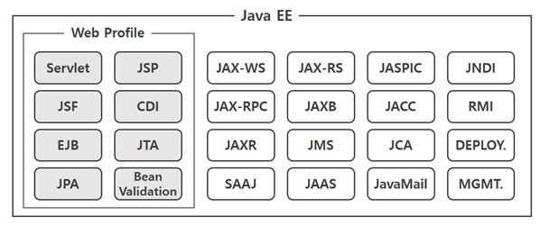
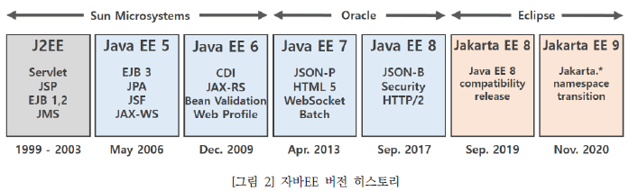
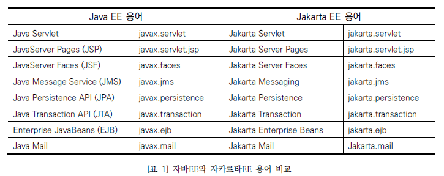
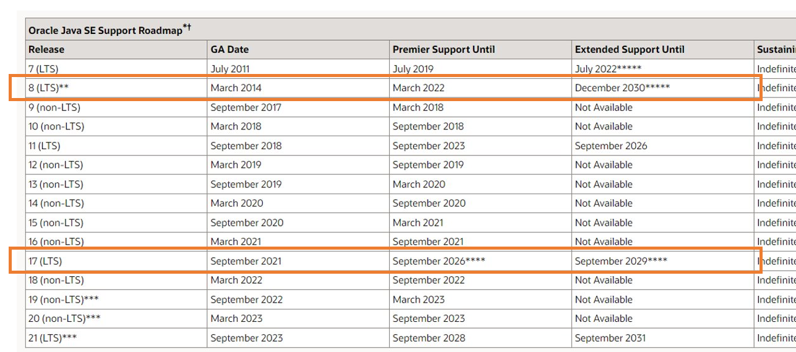
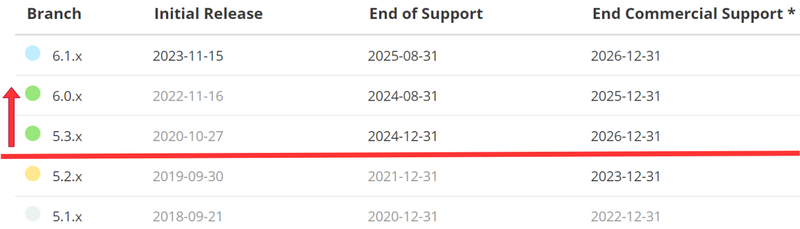
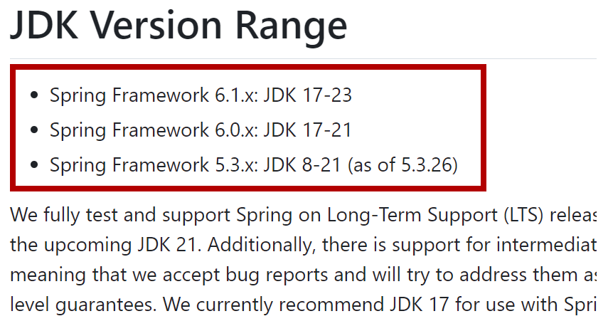
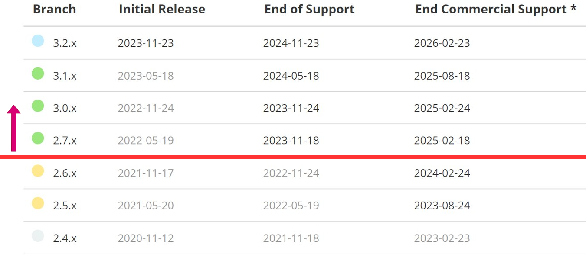
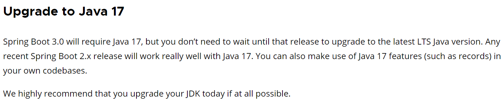
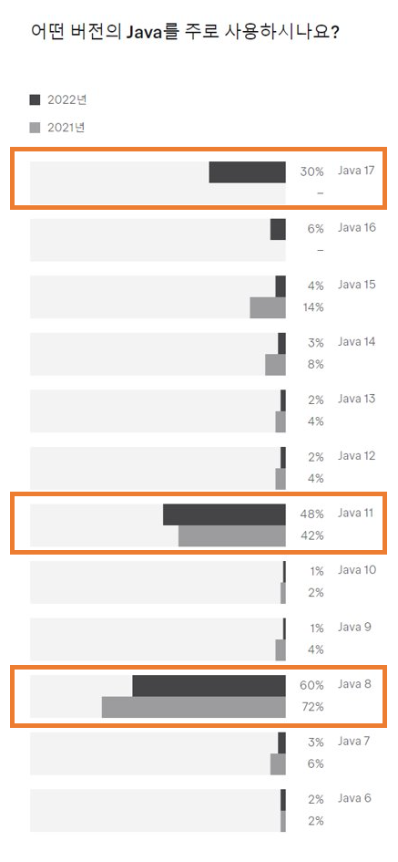

### 목차

1. JDK와 Java EE
2. Java EE와 Jakarta
3. Spring과 Java EE
4. Spring framework
5. Spring boot
6. 결론

---

## 1 Java 실행 환경

- JRE <sup>Java Runtime Environment</sup> : Java 프로그램을 실행하기 위한 환경
- JDK <sup>Java Development Kit</sup> : Java 프로그램을 개발하기 위한 환경
    - JRE + 개발에 필요한 도구
    - e.g. `javac`, `java`, `javadoc`, `jar` 등
    - Java SE : JDK 핵심 라이브러리
        - e.g.`java.lang`, `java.util`, `java.io` 등
- Java EE : Java SE를 기반으로 웹 애플리케이션을 개발하기 위한 run-time을 제공하는 라이브러리
    - e.g. `javax.servlet.*`, `javax.mail.*`, `javax.persistence.*` `javax.xml.*` 등

#### 여기까지 결론

Java를 사용하는 웹 개발자라면 Java EE를 사용한다 (**사용했다**)



## 2. Java EE에서 Jakarta



1. 오라클은 2017년 Java EE 8을 마지막으로 Eclipse Foundation에 양도한다.
2. 오라클은 Java EE는 양도했으나, Java 상표권은 여전히 보유하기에, Java Namespace 를 사용할 수 없다.
3. **따라서 Jakarta EE는 Namespace를 Jakarta로 변경한다.**
    - `javax.*` -> `jakarta.*`



#### 여기까지 결론

Java EE가 오라클에서 Eclipse 재단으로 넘어가면서 Namespace가 변경된다. (**개발자들 다 소스 수정해라**)

````java
import javax.servlet.http.HttpServletRequest; // Java EE

import jakarta.servlet.http.HttpServletRequest; // Jakarta EE
````

## 3. JDK 와 Spring

### Oracle JDK 지원기간



- JDK 8이 가장 지원기간이 길다!
    - JDK 지원기간은 Java 8 -> 17 순으로 길다

### Spring 지원 기간

#### spring framework






##### spring boot





- spring boot는 Java 17을 필수로 요구한다

## 4. 결론


## 번외) 그렇다면 무엇을 많이들 쓰고있는가?




## 참고

- [Spring.io support](https://spring.io/projects/spring-framework#support)
- [Spring.io blog : Preparing for Spring Boot 3.0](https://spring.io/blog/2022/05/24/preparing-for-spring-boot-3-0)
- [SAMSUN SDS 인사이트 리포트 Java EE에서 Jakarta EE로의 전환](https://www.samsungsds.com/kr/insights/java_jakarta.html)
- [Java EE Platform Specification](https://javaee.github.io/javaee-spec/)
- [JETBRAINS 개발자 에코시스템](https://www.jetbrains.com/ko-kr/lp/devecosystem-2022/java)
- [여기어떄 기술블로그 우리팀이 JDK 17을 도입한 이유](https://techblog.gccompany.co.kr/%EC%9A%B0%EB%A6%AC%ED%8C%80%EC%9D%B4-jdk-17%EC%9D%84-%EB%8F%84%EC%9E%85%ED%95%9C-%EC%9D%B4%EC%9C%A0-ced2b754cd7)
- [Oracle Java SE Support Roadmap](https://www.oracle.com/java/technologies/java-se-support-roadmap.html)
