### 목차

1. 용어 정리
2. JDBC의 발전 과정
3. JPA 소개
4. JPA의 차별점
5. JPA 적용 전략 (ing)
6. 주의사항

---

## 1. 용어 정리

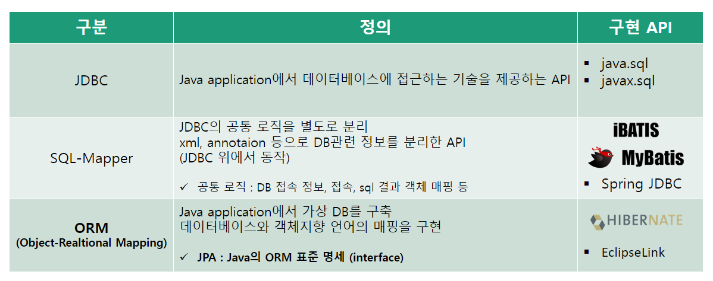

## 2. JDBC의 발전 과정

#### JDBC 코드

````
// 1. 드라이버 로딩
Class.forName("com.mysql.jdbc.Driver");

// 2. 연결
Connection connection = DriverManager.getConnection(url, "user", "password");

// 3. statement 생성
Statement statement = connection.createStatement();

// 4. 쿼리 실행
ResultSet resultSet = statement.executeQuery("SELECT * FROM MEMBER ...");

// 5. 결과 처리
while (resultSet.next()) {
    String id = resultSet.getString("ID");
    String name = resultSet.getString("NAME");
    ...
}

// 6. 자원 닫기
resultSet.close();
statement.close();
connection.close();
````

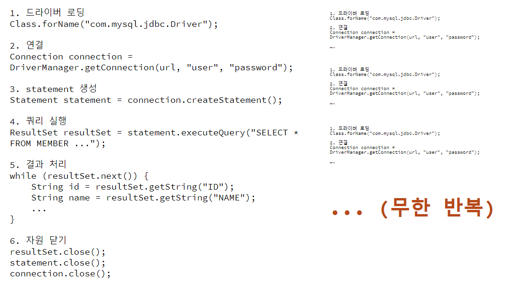

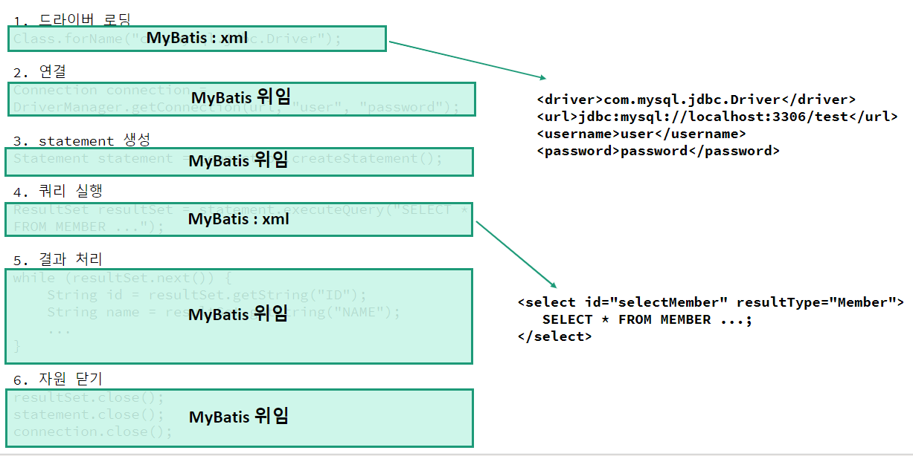

## 3. JPA  소개

### 3.1 JPA란 무엇인가

- ORM은 객체지향적 프로그래밍으로 데이터베이스를 다룬다
- Java는 JPA API를 통해 ORM 표준 명세를 정의
- JPA를 사용하기 위해서는 JPA를 구현한 Hibernate, EclipseLink, DataNucleus 등의 구현체가 필요
    - Hibernate가 압도적으로 많이 사용됨

#### ORM, Object-Relational Mapping

- 객체 지향 언어 진영의 가상의 데이터베이스 구축
- 페러다임 불일치 문제 : 객체 지향 언어와 데이터베이스 간의 간극
    - 상속 vs 테이블 상속
    - 연관관계 vs 외래 키

#### JPA, Java Persistence API

- Java의 ORM을 구현하기 위한 표준 명세 (인터페이스의 모음)
- Hibernate, EclipseLink, DataNucleus 등의 구현체가 존재
- Hibernate가 압도적

### 3.2 트렌드

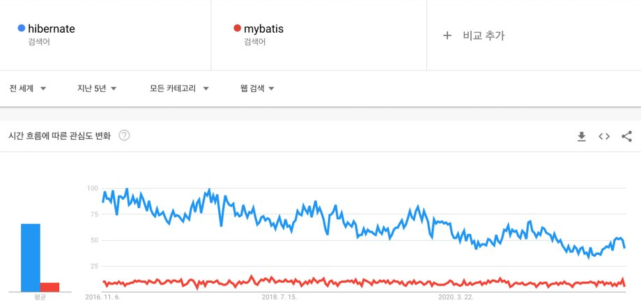

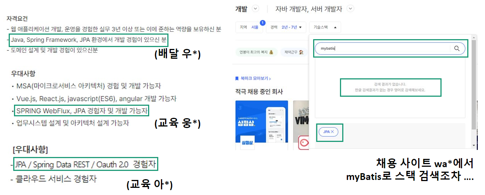

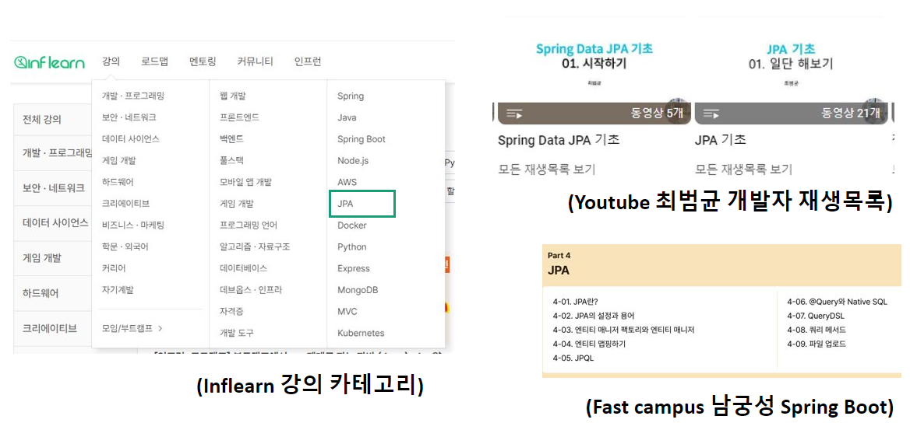

## 4. JPA의 차별점

### 4.1 JPA의 기본 구조

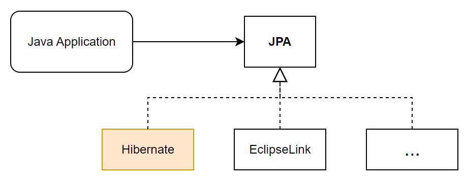

- JPA 구현체로는 Hibernate가 압도적
- 이 자료에서는 JPA = Hibernate로 표현

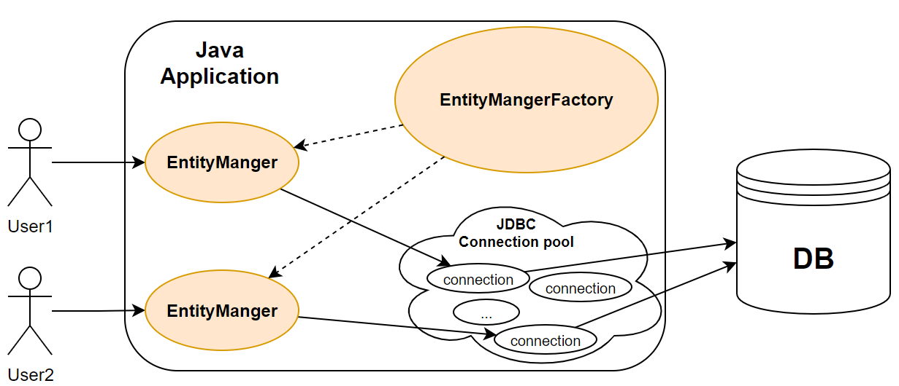

- `EntatiMangerFactory` : JPA의 전체적인 동작을 담당, Application당 하나만 생성
- `EntityManager` : 엔티티를 저장, 수정, 삭제, 조회 등 엔티티와 관련된 모든 일을 처리, 쓰레드 간에 공유 X, 사용하고 버려야 함

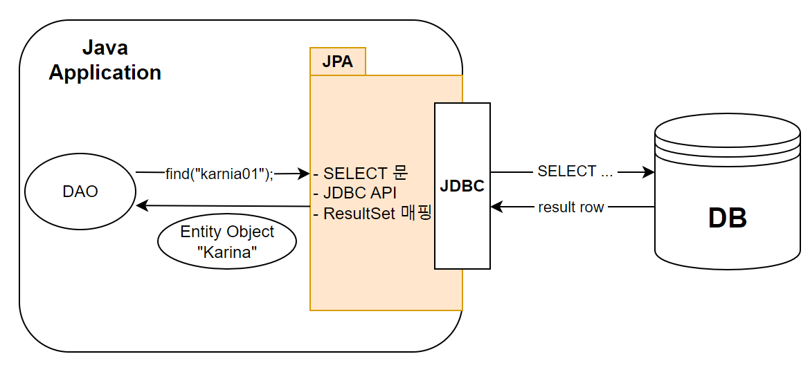

#### 조회 예시

````
// SELECT
EntityMangerFactory emf = Persistence.createEntityManagerFactory("helloJPA");
EntityManager em = emf.createEntityManager();

Member karina = em.find(Member.class, "karina01");

````

- `Persistence` : JPA의 동작에 필요한 모든 정보를 가지고 있음
- `find()` 를 통해 조회

````

Member karina1 = em.find(Member.class, "karina01");
Member karina2 = em.find(Member.class, "karina01");
System.out.println(karina1 == karina2); // true

````

- JPA는 같은 EntityManger에서의 Entity에 대한 객체 일관성을 보장한다 (identity)

### 4.2 캐시

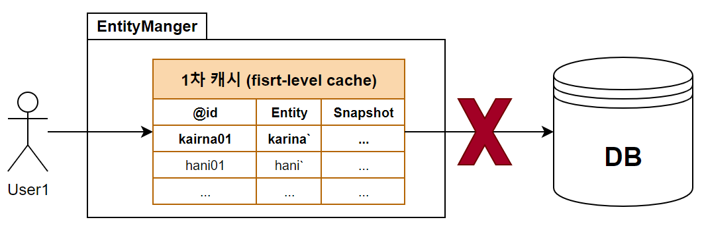

- EntityManager의 1차 캐시에 동일한 `@Id`로 캐시가 있으면, DB 조회를 하지 않고 캐시에서 조회
    - JVM 메모리 절약 : 1차 캐시에 존재하는 객체는 GC 대상이 아님, Heap에 인스턴스 하나
    - Database의 동일한 row에 대한 JVM 객체 일관성 확보
    - DB 조회 절약 : 1차 캐시에 존재하는 객체는 DB 조회를 하지 않음

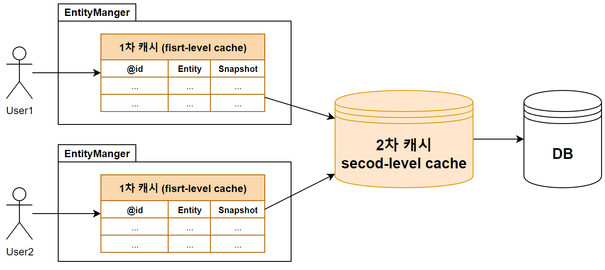

- 1차 캐시 (first-level cache) : EntityManager 내부에 존재하는 캐시
- 2차 캐시 (second-level cache) : EntityManagerFactory 내부에 존재하는 캐시

### 4.3 객체 그래프 탐색

````
Member karina = em.find(Member.class, "karina01");
karina.getTeam()            // N:1 관계 | 소속팀 | AESPA
      .getEntertainment()   // N:1 관계 | 소속사 | SM
      .getNation()          // N:1 관계 | 국적   | KOREA
      .getPresident()       // 1:1 관계 | 대통령 | 아무개
      .getCollege();        // 1:1 관계 | 대학   | 한국대학교
      
````

- 객체 그래프 탐색에 NPE 부담 없이 가능
- `FetchType.LAZY` : 객체 그래프 탐색 시, 해당 객체를 사용할 때 쿼리를 날림
- `FetchType.EAGER` : 객체 그래프 탐색 이전에 join으로 쿼리를 날림
- DB, JVM 양쪽의 메모리 절약 가능

### 4.4 쓰기 지연

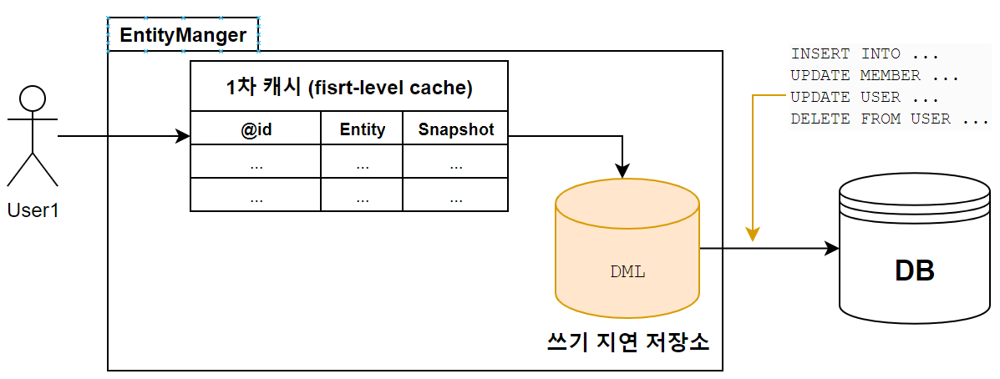

````
Transaction tx = em.getTransaction();
Member karina = new Member("karina01", "카리나", 22);
em.persist(karina); // INSERT X

Member gisele = em.find(Member.class, "gisele01");
gisele.setAge(23);  // UPDATE X

tx.commit();        // INSERT, UPDATE 실행
````

- DML 개수만큼 `JdbcConnection`을 사용하지 않음
- DML 개수만큼 DB 통신이 일어나지 않음

### 4.5 그 외

#### 낮아진 DB 의존도

- DBMS 벤더에 대한 의존성이 상대적으로 낮음
- SQL 문 직접 작성이 드뭄
- DBMS 마이그레이션 시 부담이 덜함

#### 개발 생산성

- 반복적인 CRUD를 JPA에 위임
- 반복 코드 제거
- SQL-mapper 의 모든 기능 포함
  - SQL Hint
  - 복잡한 SQL 별도 관리
  - xml 로 SQL 분리
  - SQL result mapping
  
#### 편리한 라이브러리

- Spring Data JPA
  - Hibernate + Spring Framework 조건
  - Hibernate보다 더 추상적인 코드로 작성
- JPQL, QueryDSL
  - 객체지향 쿼리 언어 작성
- MyBatis와 동시 사용 가능

## 5. JPA 적용 전략 (ing)

- 테이블 수 : 약 40개
- SELECT : 약 200개
- DML : 약 50개

#### 적용 순서

1. Table, Entity 매핑
2. fetchType 전략 설정
3. `SELECT` JPA 적용
4. test code 작성
5. DML JPA 적용
6. test code 작성
7. 최종 확인

### 적용 지표

- Native Query 사용 비율
- 1차, 2차 캐시를 활용, 기존 SQL과의 응답 시간 비교
  - test code 활용

## 6. 주의사항

### 데이터베이스 > JPA

- JPA는 더 나은 기술로 교체 가능
- DBMS는 더 오래감
- MyBatis, ORM 등의 본질은 DB 접근 기술
  - **고객의 데이터가 담긴 DB가 훨씬 중요**

### ORM = 객체지향 +  RDBMS

- ORM의 두 축 : 객체지향, RDBMS 
- ORM 실력은 객체지향과 RDBMS실력에 의존함
