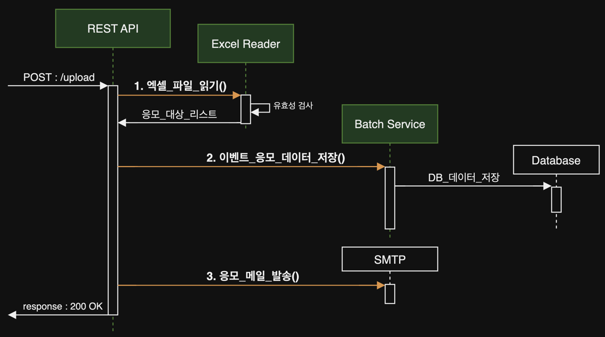

# Batch 업무 튜닝기 (1차)

1. 배치 업무 설명
    - 배치?
    - 이번 배치 업무
2. 배치 업무 성능 향상 전략
    - 비동기, 병렬처리
    - Database I/O
    - network I/O
3. 성능 개선 소개
    - Bulk Insert sql 문
    - 비동기, 병렬 프로그래밍
4. 남겨진 숙제들

---

## 1. 배치 업무 설명

### 배치?

- 사전적 정의 : 한 묶음, 1회분, 일괄 처리하다(동사)
- 개발에서 Batch : 대용량의 데이터를 처리하는 업무
    - 대용량? : 2개 이상의 트랜잭션 (HTTP) 요청에 준하는 데이터 량
- 업무 특성
    - 대량 I/O (파일 입출력, 데이터베이스 등)
    - 비동기, 병렬 프로그래밍
    - Job, Scheduler, Cron 으로 Batch 작업 주기화

### 배치 업무 소개 (이번 작업)



- 단순 사용자 HTTP 트랜잭션 아닌가?
- Batch에 준하는 업무를 사용자 HTTP 트랜잭션 요청에 처리되어야함
    - File I/O : row 수의 제한없는 Excel file
    - Database I/O : Bulk Insert (대상 table 3개)
    - Network I/O : 외부 SMTP 서버 연동
- 서버 구현이 배치에 준하는 정도로 개발 되지 않으면 사용자 응답 시간이 급격하게 증가할 수 있다

## 2. 배치 업무 성능 향상 전략

### 비동기, 병렬처리

- Spring Framework 의 Spring MVC는 기본적으로 동기 처리
    - 1 request (transaction) = 1 thread
    - @Async, @EnableAsync 를 통해 쉽게 비동기 프로그래밍 구현 가능 (Spring 3.0)
    - 여전히 client blocking
- Spring WebFlux (Spring 5.0)
    - 완전한 client non-blocking (reactive programming, MSA 적합)
- Java 8 API 사용
    - non-blocking : CompletableFuture (Java 8) fork-join pool
    - 병렬 : Streams API (Java 8) parallelStream

### Database I/O

- Bulk insert, Bulk update
    - JDBC batch size 설정
    - JPA queryDSL bulk
- input 규모에 따른 batch size, commit 주기
- 데이터 채번 방식
- Database index

### network I/O

- 서버 간의 비동기 I/O 연동
- 메시지 큐 시스템 (Kafka, RabbitMQ, Redis 등)
- 서버 간의 통신 시 client thread blocking 시간 최소화

## 3. 성능 개선 소개

### Bulk Insert sql 문

```SQL
-- 1. ROW 수만큼 INSERT STATEMENT
INSERT INTO TB1 (COL1, COL2, COL3, ...) VALUES(VAL1, VAL2, VAL3, ...);
INSERT INTO TB1 (COL1, COL2, COL3, ...) VALUES(VAL1, VAL2, VAL3, ...);
INSERT INTO TB1 (COL1, COL2, COL3, ...) VALUES(VAL1, VAL2, VAL3, ...);
COMMIT;
....

-- 2. INSERT ALL
INSERT ALL 
    INTO TB1 (COL1, COL2, COL3, ...) VALUES(VAL1, VAL2, VAL3, ...)
    INTO TB1 (COL1, COL2, COL3, ...) VALUES(VAL1, VAL2, VAL3, ...)
    INTO TB1 (COL1, COL2, COL3, ...) VALUES(VAL1, VAL2, VAL3, ...)
	...
SELECT * FROM DUAL;
COMMIT;

-- 3. INSERT INTO ... UNION ALL 
INSERT INTO TB1 (COL1, COL2, COL3, ...)
SELECT VAL1, VAL2, VAL3, ... FROM DUAL UNION ALL
SELECT VAL1, VAL2, VAL3, ... FROM DUAL UNION ALL
SELECT VAL1, VAL2, VAL3, ... FROM DUAL UNION ALL
....
SELECT VAL1, VAL2, VAL3, ... FROM DUAL;
COMMIT;
```

### 채번 로직

```SQL
-- 채번에 사용할 Oracle Sequence
CREATE SEQUENCE  내가_생성한_시퀀스
    START WITH 1
    INCREMENT BY 1
    ...
    MAXVALUE 999 -- 최댓값 : 999 (세자리)
    CYCLE; -- 최대값에 도달하면 1부터 다시 시작
    
-- 채번 DB Function
create OR REPLACE FUNCTION "채번_디비_펑션"()
    RETURN VARCHAR2
AS
    O_OUT VARCHAR2(20);
BEGIN
    
    /*
    * 현재날짜 + 시퀀스 SEQ_PE_PID (4자리) + 난수 (최대값 9999)
    */
    SELECT TO_CHAR(SYSDATE, 'YYMMDD') -- 현재 날짜
        || TO_CHAR(내가_생성한_시퀀스.NEXTVAL, 'FM0000') -- 시퀀스
        || TO_CHAR(DBMS_RANDOM.VALUE(1, 9999), 'FM0000') -- 난수 (1 ~ 9999)
    INTO O_OUT
    FROM DUAL;

    RETURN O_OUT;
END 채번_디비_펑션;
/

```

- 날짜 + Oracle Squnce + 난수
    - 날짜 YYYYMMDD
    - Sequence 최댓값 999, CYCLE
    - 난수 4자리
- 하루 최대 999개의 채번 보장
- 채번 데이터 컬럼 사이즈 유한
- 탄력적 운용
    - Oracle Suquence MAXVALUE 조절
    - Cache 옵션 조절
    - 채번 데이터 컬럼 Index

### 비동기, 병렬 프로그래밍

````
// fork 1 : table 1 insert
CompletableFuture<Void> insertTB1 = CompletableFuture.runAsync(() -> {
    repository.executeNativeQuery(nativeQuery1);
});

// fork 2 : table 2 insert
CompletableFuture<Void> insertTB2 = CompletableFuture.runAsync(() -> {
    repository.executeNativeQuery(nativeQuery2);
});

// fork 3 : table 3 insert
CompletableFuture<Void> insertTB3 = CompletableFuture.runAsync(() -> {
    repository.executeNativeQuery(nativeQuery3);
});

// join : blocking
CompletableFuture.allOf(insertTB1, insertTB2, insertTB3).join();

// Java 7

ExecutorService executor = Executors.newFixedThreadPool(3);

Future<?> insertTB1 = executor.submit(new Runnable() {
    @Override
    public void run() {
        // Insert into table 1
        repository.executeNativeQuery(nativeQuery1);
    }
});

Future<?> insertTB2 = executor.submit(new Runnable() {
    @Override
    public void run() {
        // Insert into table 2
        repository.executeNativeQuery(nativeQuery2);
    }
});

Future<?> insertTB3 = executor.submit(new Runnable() {
    @Override
    public void run() {
        // Insert into table 3
        repository.executeNativeQuery(nativeQuery3);
    }
});

// Wait for all tasks to complete
try {
    insertTB1.get();
    insertTB2.get();
    insertTB3.get();
} catch (Exception e) {
    e.printStackTrace();
}

executor.shutdown();
````

- CompletableFuture (Java 8)
    - API 수준으로 비동기, 병렬 프로그래밍 구현
    - fork-join pool 사용
    - runAsync() : non-blocking, fork
    - join() : blocking, join

````
//테스트 코드
@Test
@ParameterizedTest
@ValueSource(ints = {100, 1000, 5000, 10000, 50000, 100000, 200000}) // 100 ~ 20만건 테스트
@DisplayName("jdbc_template_native_query_async")
@Transactional
@Rollback(false)
public void jdbc_template_native_query_async(int bulkSizeParam) throws Exception {
    //given
    setUpParam(bulkSizeParam); // 테스트 데이터 생성

    long beforeTime = System.currentTimeMillis(); // 코드 실행 전에 시간 받아오기
    
    // when
    PeCustomerBatchResult batchResult = batchService.insertUser(peCustomerDTOExcelList); // batch 실행

    long afterTime = System.currentTimeMillis(); // 코드 실행 후에 시간 받아오기
    long secDiffTime = (afterTime - beforeTime);
    System.out.println("최종 실행시간(m) : " + secDiffTime);
    
    // then
    List<PeCustomerDTO> inserted = batchRepository.byTid(batchResult.getTid());

    assertThat(CollectionUtils.isEmpty(inserted), is(false));
    assertThat(inserted.size(), is(bulkSizeParam));
}
````

- JUnit @ParameterizedTest
    - 테스트 코드 반복 실행
    - @ValueSource : 테스트 코드 반복 실행에 사용할 파라미터 지정
- given-whne-then
    - given : n건 데이터 생성
    - when : batch 실행
    - then : batch 결과 검증
- 테스트 코드 실행 시간 측정
    - System.currentTimeMillis() : 코드 실행 전, 후 시간 측정

## 4. 남겨진 숙제들

### 성능이 좋다 = 빠르다 ?

- 사용자는 빠르면 장떙이다
- 빠르다 -> 리소스 영끌 -> 한정적 리소스(on-promise) -> 다시 느려짐...
- Heap 모니터링 : visualVM, HeapDump
- 성능 측정: JMH
- 테스트 : JUnit
- [스터디](https://github.com/gihyeon6394/java-tune)

### 메시지 큐 시스템


- 서버간의 강결합
    - was - db 강결합
    - was - smtp 강결합
- 마이크로 서버로 분리
    - 서버간의 통신 메시지 큐 (Kafka, RabbitMQ)
- 서버 간의 통신은 이벤트 기반 비동기 메시지 큐 시스템으로
    - EDA (Event Driven Architecture)
- [스터디](https://github.com/gihyeon6394/dev-essentials/blob/main/Kafka_The_Definitive_Guide/README.md)

#### Kafka 주요 특징

- LinkedIn에서 사용자 활동 추적을 위해 개발
- use-case
    - 사용자 활동 추적
    - 메시징
    - 메트릭, 로깅
    - commit log (change log, event sourcing)
    - 스트리밍
- 오픈소스로서 LinkedIn, Confluent 등에서 개발 및 유지보수